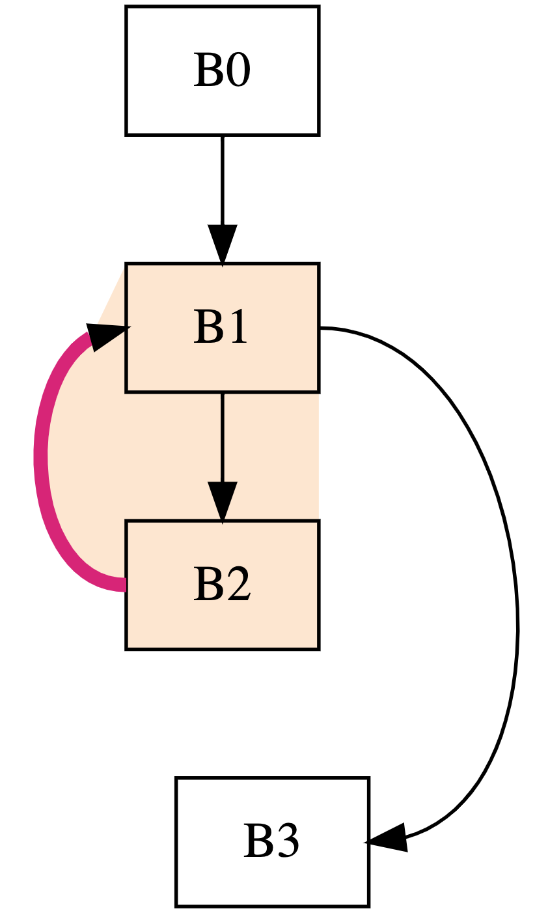
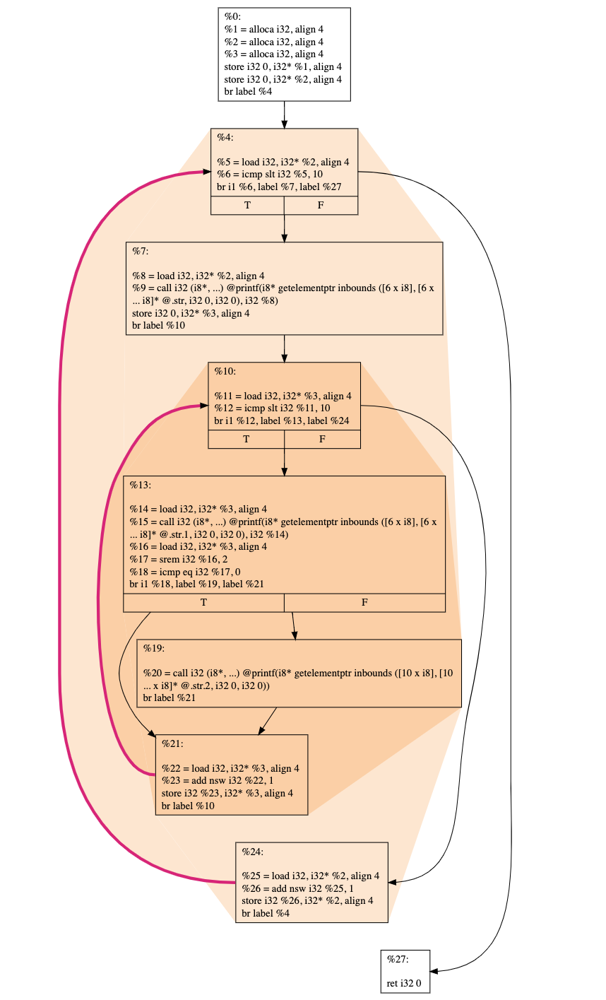

Welcome to the evaluation of _CFGConf_. Thank you for taking the time to partipate in the evaluation. Your participation will help us gather valuable feedback to improve the language and the system in the future versions. 

This study has been approved by the University of Arizona Institutional Review Board (IRB). For more details, view the consent information for the [study](irb/Consent-Information-Study.pdf) and the accompanying [survey](irb/Consent-Information-Survey.pdf). Instead of conducting the study through a remote video session, we are conducting the study offline. No identifying data is recorded during the study. 

_CFGConf_ is a JSON-based language for visualizing Control Flow Graphs (CFGs). CFGConf is designed to make it convenient to generate drawings of graphs with just a few lines of JSON code. With its domain-specific layout for visualizing loops and flexible ways to filter and collapse the graph, you will be able to visualize graphs that match the mental model of the users without writing complicated program code. 

As part of the evaluation, you will be asked to perform selected tasks and to provide your feedback on _CFGConf_. This is an offline evaluation. **There is no time limit. You can finish as many tasks as your time permits.** 

**NOTE:** We are evaluating the usefulness of our language/system and not your knowledge on CFGs or graph drawing. You can refer to the [wiki](https://github.com/devkotasabin/cfgConf/wiki) at any time. You can contact devkotasabin@email.arizona.edu with any queries or issues when performing the tasks.

When you finish the tasks, **please fill out the survey [here](https://forms.gle/1AAVEF1fYCK3rHaR8)**. The survey will collect your feedback on your experience with using _CFGConf_ and how it can be improved. 

## Tasks

The related files for each tasks are located in individual folders inside the `tasks` directory. The tasks directory is located here `cfgConf > static > CFGConf > files > tasks`. After completing the tasks, you can provide the resulting _CFGConf JSON files_ in the **survey**. You can also add additional comments related to each task e.g. the strategy you used for the task, what worked and what didn't, and any feedback to improve _CFGConf_. Lets continue with the tasks.

### Task 0: Running a hello world example
Let us first get familiar with CFGConf before moving to the tasks. Run the hello world example according to the [setup guide](https://github.com/devkotasabin/cfgConf/wiki/Setup-Guide) in the wiki. Then you can move to the [quickstart guide](https://github.com/devkotasabin/cfgConf/wiki/Quickstart-Guide) to see common usage examples of _CFGConf_. For more details, you can use the [reference guide](https://github.com/devkotasabin/cfgConf/wiki/Reference-Guide).

### Task 1: 
Replicate the drawing below i.e create a _CFGConf JSON file_ that creates the provided drawing.
<p align="center">
  
</p>

### Task 2:
Produce a drawing of the graph from the dot file `t2.dot`. Loops inside the graph are provided in the file `t2_loops.json`. The drawing should look as follows:

<p align="center">
  
</p>

Compare the resulting drawing from _CFGConf_ to the drawing produced using _dot graphviz_ on the file `t2.dot`. To produce a pdf file using _dot graphviz_, you can run the following command in the terminal which will output the file `t2.pdf` in the same directory.
```
dot -Tpdf t2.dot -o t2.pdf
```

### Task 3:
#### 3.1
Produce a filtered drawing using the graph `ltimes.dot`. This graph is produced from a benchmark code used to measure the performance of High Performance Computing systems. A dyninst analysis file named `ltimes.json` is provided as well. This file contains the functions and loops in the program. Refer to the [`data` section](https://github.com/devkotasabin/cfgConf/wiki/Reference-Guide#data-object) in the reference guide to see how to use the analysis file. Produce the drawing with only the node id inside the node. Refer to the [filtering section](https://github.com/devkotasabin/cfgConf/wiki/Reference-Guide#graph-filtering-options) to produce a filtered graph. Note the output when the filtering is not applied.

#### 3.2
Use the following set of nodes as the starting nodes for filtering.
```
"B1973", "B1974", "B1978", "B1986", "B1993", "B4052", "B4183", "B4205", "B4206", "B4430"
```

### Task 4:
Produce a filtered drawing using the same graph files `ltimes.dot` and `ltimes.json`. Use the following set of nodes as the starting nodes for filtering. 
```
"B3805", "B4451"
```
Now, produce the drawing with all functions collapsed except the functions containing the loops and the function with the name `__kmpc_fork_call`.

## Thank you
Thats it!. We are done with the tasks. Thank you for giving your valuable time for the evaluation of _CFGConf_. Please do not forget to complete the survey where you will be asked to upload your JSON files and provide your feedback. You can access the survey [here](https://forms.gle/1AAVEF1fYCK3rHaR8). Looking forward to your valuable feedback. 


